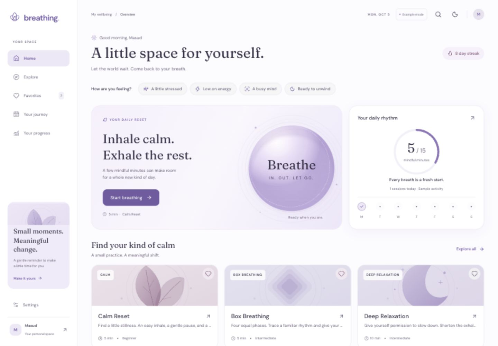
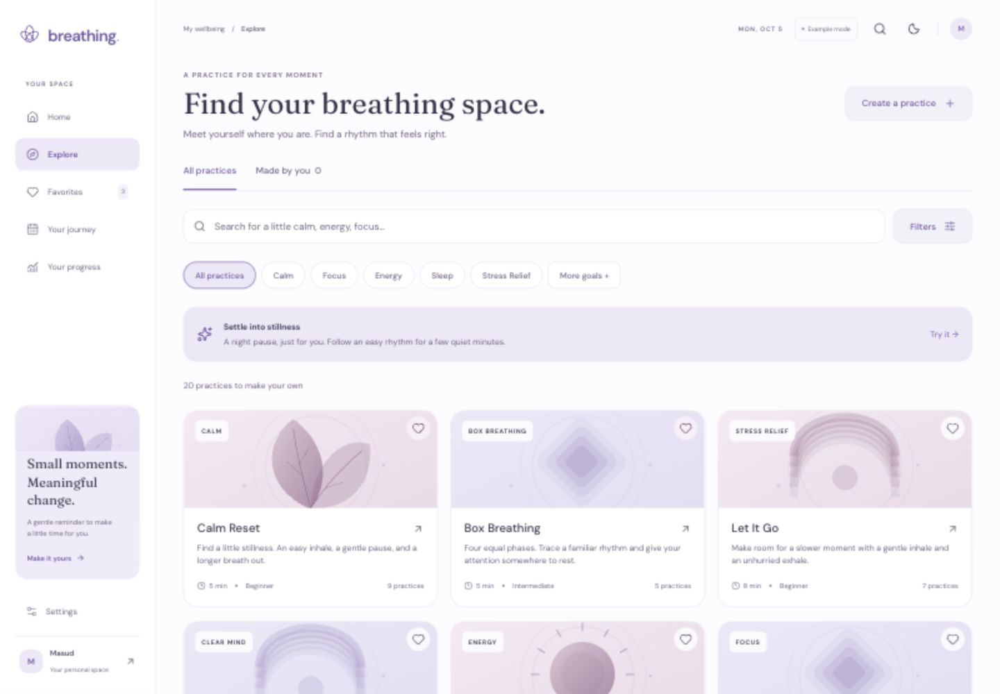
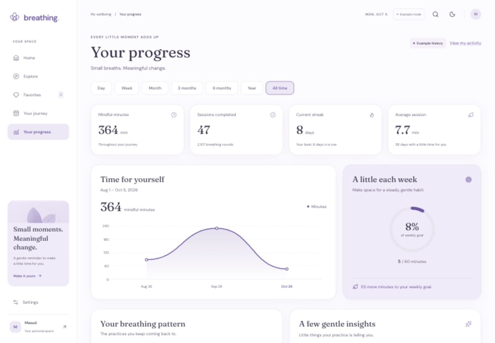
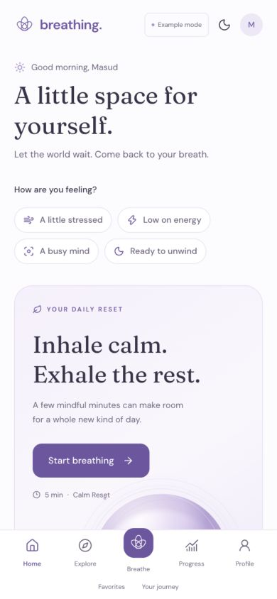
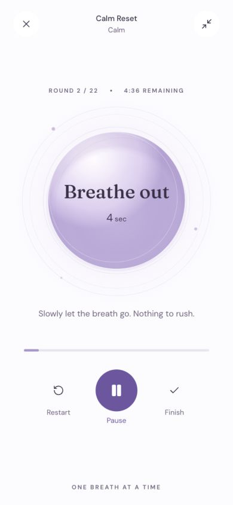

# Breathing

[](https://github.com/masudfcs1/Breathing.A-little-space-for-yourself-ReatNative/actions/workflows/ci.yml)

A local-first React Native wellness application with a responsive browser preview. A white day theme with soft lavender accents, a forest-green night theme, original SVG artwork, and a gently animated breathing orb create a calm visual identity. React Native components power both the mobile and browser interfaces.

There is no backend, account system, analytics service, or external data API. Personal practice data stays on the current device/browser unless the user exports it.

## Screenshots

Actual React Native Web previews of the day theme in desktop and mobile browser layouts. Activity and statistics shown use the app's sample data.



| Explore · Desktop | Progress · Desktop |
| --- | --- |
|  |  |

<table align="center">
  <tr>
    <th>Home · Mobile preview</th>
    <th>Breathing session · Mobile preview</th>
  </tr>
  <tr>
    <td align="center"></td>
    <td align="center"></td>
  </tr>
</table>

## Run locally

Use Node.js 24, matching `.nvmrc` and CI. If you use nvm, run `nvm install` and `nvm use` in this directory.

```sh
npm ci
npm run dev
```

Open the local address printed by Vite, normally `http://localhost:5173`. The browser layout adapts from a mobile tab bar to a desktop sidebar. `npm run web` starts the same browser development server.

For native development:

```sh
npm start
npm run ios
npm run android
```

The iOS command requires a configured Xcode simulator on macOS; Android requires a configured Android emulator or connected device. Native runtime/device compatibility depends on the installed Expo SDK. This repository does not include signed store builds, provisioning, or deployment credentials. Native simulator and physical-device behavior has not been verified in this implementation session.

Build and check the frontend:

```sh
npm run typecheck
npm test
npm run build
npx vite preview --host 0.0.0.0
```

The browser production output is written to `dist/`. Serve it at the root of an HTTPS origin, or localhost during development.

## Continuous integration

[GitHub Actions](https://github.com/masudfcs1/Breathing.A-little-space-for-yourself-ReatNative/actions/workflows/ci.yml) runs for pushes and pull requests targeting `main`, merge-queue checks, and manual runs from the Actions tab.

| Check | What it verifies | Downloadable output |
| --- | --- | --- |
| TypeScript and unit tests | Strict TypeScript checks and the Vitest suite | JUnit test report, retained for 14 days |
| Web production build | Vite bundle plus the HTML entry, service worker, manifest, and icon | Web distribution, retained for 7 days |
| iOS and Android bundles | Metro resolves and exports production Hermes bundles for both native platforms | Native bundles and assets, retained for 7 days |

The two build jobs run in parallel after the quality checks pass. Every job installs the committed lockfile with `npm ci`. Workflows use read-only repository permissions, commit-pinned Actions, a cached npm download store, time limits, and cancellation of superseded runs. Test reports are retained even when tests fail. Dependabot opens a weekly reviewable pull request when pinned GitHub Actions have updates.

Run the same checks locally:

```sh
npm ci
npm run typecheck
npm run test:ci
npm run build:web
npm run build:native
```

Generated `reports/`, `dist/`, and `dist-native/` output is ignored by Git. Select a completed workflow run to download its artifacts. The native export checks JavaScript, assets, and Hermes compilation; it does not produce an APK/IPA, compile native projects, or run an emulator. CI requires no Expo account, signing credentials, or deployment secrets, and does not deploy the app.

## Use the app

1. Explore the overview immediately. “Make it yours” / “Personalize my practice” opens optional onboarding for an intention, daily goal, and preferred time. Personalization does not block exploration.
2. Discover a preset, filter exercises, save favorites, or create a custom rhythm. Favorites can be reordered.
3. Select a time target or a number of complete rounds. Inhale and exhale support 1–60 seconds; hold and rest support 0–60 seconds. Zero skips that phase. Time sessions support 1–60 minutes; round sessions stop on a complete round and are bounded to four hours.
4. Follow the orb and phase countdown. Pause, resume, restart, finish early, enter minimal mode, or discard the session. Backgrounding the app or hiding the browser tab pauses the practice. Resume is explicit.
5. Completion saves the actual active practice time and fully completed rounds. Preparation and paused time do not count. A save failure offers retry; leaving without saving requires confirmation.
6. Review dates, recent activity, category use, streaks, trends, and daily/weekly minute goals. Recommendations are deterministic calculations from local history, favorites, and device time.

Settings include profile preferences, light/dark/system appearance, larger text, higher contrast, reduced motion, session defaults, backup import/export, and history clearing. Auto-start is opt-in and skips configuration using saved defaults. Native devices expose phase haptics; browser haptic controls are intentionally omitted.

## Local data and example activity

On first launch the app displays clearly marked example activity generated across approximately 45 days. It is held separately from real session history. Use the “Example mode” control to switch to personal activity. Finishing a real practice switches to personal activity automatically; sample sessions are never added to a backup or counted as real practice.

AsyncStorage holds a versioned application snapshot under `@breathing/app-data/v1`. In the browser it uses that browser origin's local storage. Serialized writes preserve update ordering; duplicate completion IDs are idempotent. Import validates the complete backup before replacing local data, and the interface previews the replacement. A malformed stored payload is copied to a recovery key where possible before reporting a load error.

Browser exports download a JSON file. Native export uses the system share sheet. Imports accept pasted JSON on all platforms, with file selection additionally available in the browser. Import replaces the current local snapshot; it does not merge histories. Export a backup before clearing data or switching devices. This storage is not an encrypted vault or a cross-device sync service.

## Offline behavior

Session guidance, SVG artwork, fonts, recommendations, and analytics use bundled assets and local data. A packaged native application does not need network access for these features; the Expo development client still needs its development bundle.

The browser production entry registers an app-shell service worker. Offline reload requires a successful first visit to the production build and completion of asset caching. Test offline behavior using `npm run build` and the production preview or an HTTPS deployment. The Vite development server intentionally does not install a service worker and cannot provide an offline reload. Clearing site data removes cached assets and local practice history.

## Architecture

| Location | Responsibility |
| --- | --- |
| `App.tsx` | Providers, application shell, responsive navigation, session entry, error boundary |
| `src/screens/` | Home, discovery/favorites, date-based journey, progress, preferences |
| `src/features/breathing/engine.ts` | Pure timestamp-derived session state and monotonic pause/resume clock |
| `src/features/breathing/BreathingFlow.tsx` | Configuration, session lifecycle, confirmations, completion, persistence retry |
| `src/components/BreathingOrb.tsx` | SVG orb and phase-synchronized motion |
| `src/components/` | Shared controls, cards, charts, and original SVG illustrations |
| `src/theme/` | Shared palettes, typography, appearance, accessibility preferences |
| `src/hooks/useAppStore.tsx` | Hydration, application state, write handling, real/example separation |
| `src/storage/` | Serialized persistence, schema validation, backup formats |
| `src/analytics/` | Calendar grouping, streaks, totals, category statistics, recommendations |
| `src/data/` | Presets, defaults, deterministic example history |
| `src/types/` | Shared domain types |

The timer derives phase, progress, remaining time, and rounds from elapsed timestamps rather than counting intervals. A delayed render does not extend a session. The orb runs one React Native `Animated` animation per moving phase, with the native driver on mobile and the browser animation driver on web. It resynchronizes on phase changes, round changes, and resume. Reduced motion preserves the guide and timer while keeping the orb still. Reanimated is installed for future richer motion but is not required by the current orb implementation.

Session configuration and confirmation dialogs share one native modal presentation to avoid competing iOS modal transitions. Screen-reader labels cover timer state and controls; native phase announcements happen at phase changes rather than every clock update.

## Verification and scope

Vitest covers phase boundaries, zero-duration holds, delayed ticks, full-round and time targets, duration bounds, pause/resume/restart accounting, analytics, backup validation, and storage write ordering. TypeScript checks the shared mobile/web implementation. Browser visual and interaction QA should include narrow phone widths, dark appearance, large text, configuration, pause/restart/discard, a completed session, reload persistence, and backup import/export.

This is a frontend prototype with working local practice flows, not a medically validated breathing coach. Audio playback, ambient tracks, and spoken voice guidance are not implemented; the interface does not offer inert audio toggles. Daily and weekly goals are currently measured in minutes, not configurable session-count or consistency targets. Notifications, background practice, cloud sync, authentication, store release automation, and end-to-end native device tests are outside the current implementation. Haptic output depends on device support. Smooth animation is an implementation target, not a measured 60 FPS guarantee on every device.

# Breathing.A-little-space-for-yourself-ReatNative
